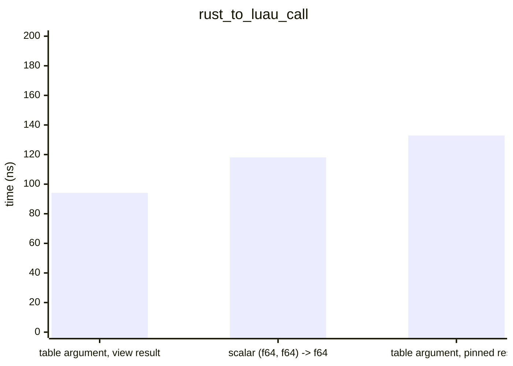
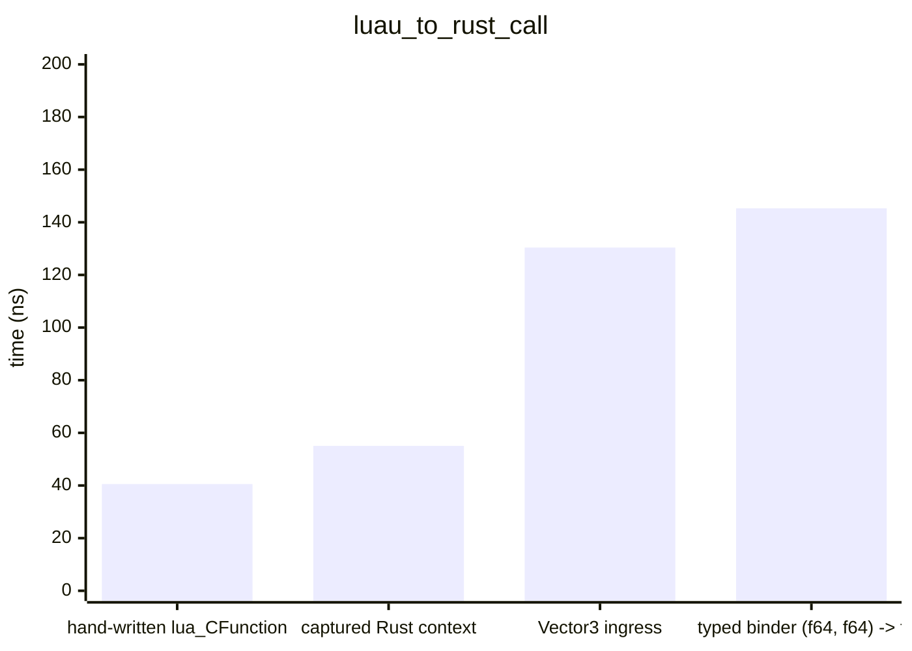
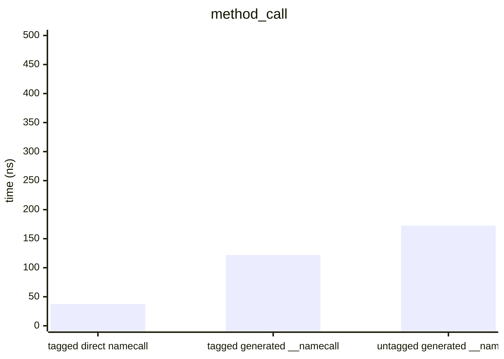
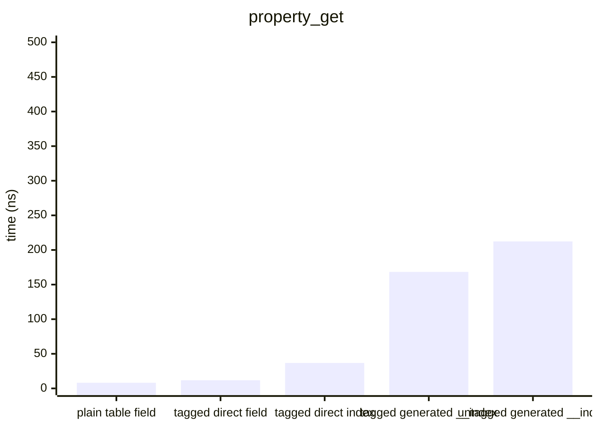
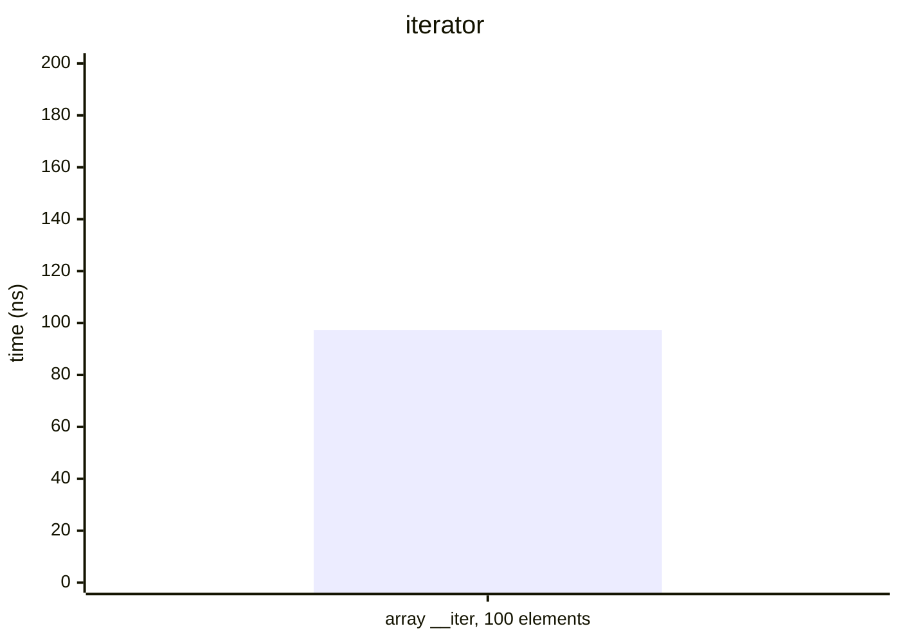
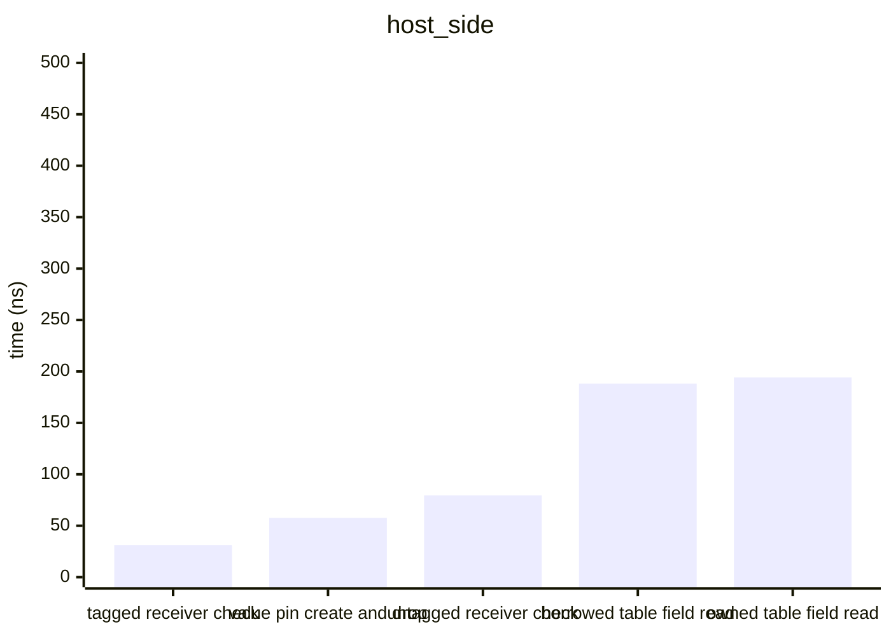

# Benchmarks

> Generated 2026-09-27 · `cargo bench --bench hot_paths` → Criterion → [scripts/gen_benchmarks.py](scripts/gen_benchmarks.py) · Intel(R) Core(TM) i7-10870H CPU @ 2.20GHz

All times are wall-clock means measured by [Criterion.rs](https://github.com/bheisler/criterion.rs) (95 % confidence interval). Debug assertions off, default features (interpreter only).

## rust_to_luau_call

`Function::invoke` from the host, per call.

| Variant | Mean | ± Std Dev |
|---|---:|---:|
| table argument, view result | 94.09 ns | 5.97 ns |
| scalar (f64, f64) -> f64 | 118.1 ns | 26.26 ns |
| table argument, pinned result | 132.9 ns | 6.01 ns |

## luau_to_rust_call

A Lua loop calling the bound function 1000 times; per call = loop / 1000.

| Variant | Mean | ± Std Dev | Per item |
|---|---:|---:|---:|
| hand-written lua_CFunction | 40.55 µs | 830.8 ns | 40.55 ns |
| captured Rust context | 55.06 µs | 2.48 µs | 55.06 ns |
| Vector3 ingress | 130.4 µs | 5.44 µs | 130.4 ns |
| typed binder (f64, f64) -> f64 | 145.3 µs | 51.06 µs | 145.3 ns |

## method_call

`obj:get()` 1000 times; per call = loop / 1000.

| Variant | Mean | ± Std Dev | Per item |
|---|---:|---:|---:|
| tagged direct namecall | 37.51 µs | 1.61 µs | 37.51 ns |
| tagged generated __namecall | 122.0 µs | 1.59 µs | 122.0 ns |
| untagged generated __namecall | 172.5 µs | 3.06 µs | 172.5 ns |

## property_get

`obj.value` 1000 times; per access = loop / 1000.

| Variant | Mean | ± Std Dev | Per item |
|---|---:|---:|---:|
| plain table field | 8.16 µs | 1.24 µs | 8.16 ns |
| tagged direct field | 11.81 µs | 533.8 ns | 11.81 ns |
| tagged direct index | 36.71 µs | 1.30 µs | 36.71 ns |
| tagged generated __index | 168.3 µs | 4.04 µs | 168.3 ns |
| untagged generated __index | 212.3 µs | 7.49 µs | 212.3 ns |

## iterator

A generic `for` over a 100-element array iterator, 1000 loops; per element = loop / 100000.

| Variant | Mean | ± Std Dev | Per item |
|---|---:|---:|---:|
| array __iter, 100 elements | 9.73 ms | 448.5 µs | 97.31 ns |

## host_side

Host-side operations, per call.

| Variant | Mean | ± Std Dev |
|---|---:|---:|
| tagged receiver check | 31.16 ns | 0.39 ns |
| value pin create and drop | 57.71 ns | 19.24 ns |
| untagged receiver check | 79.49 ns | 1.24 ns |
| borrowed table field read | 188.1 ns | 9.60 ns |
| owned table field read | 194.2 ns | 3.32 ns |

