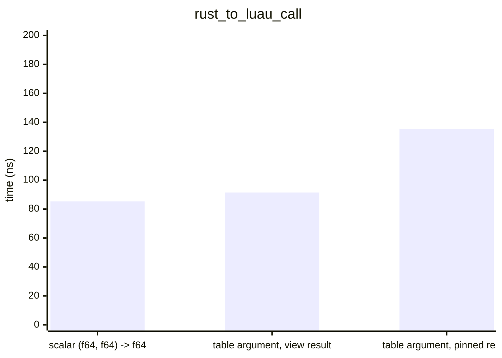
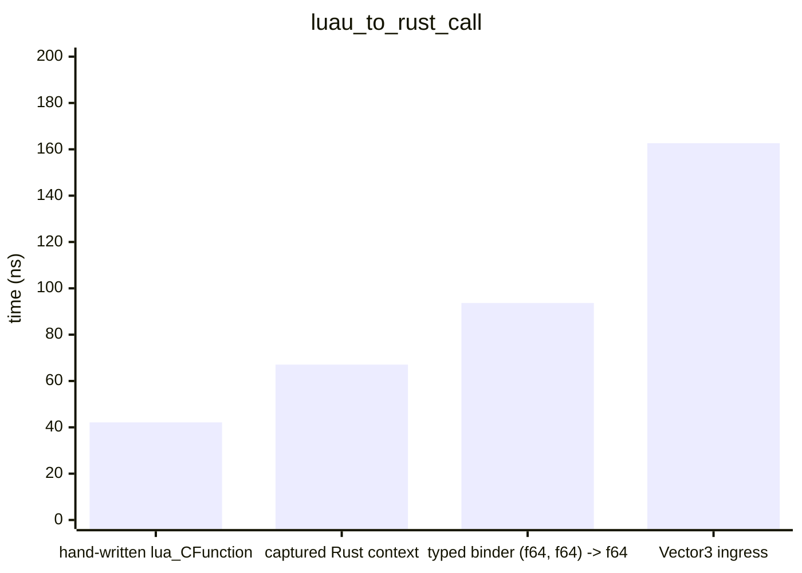
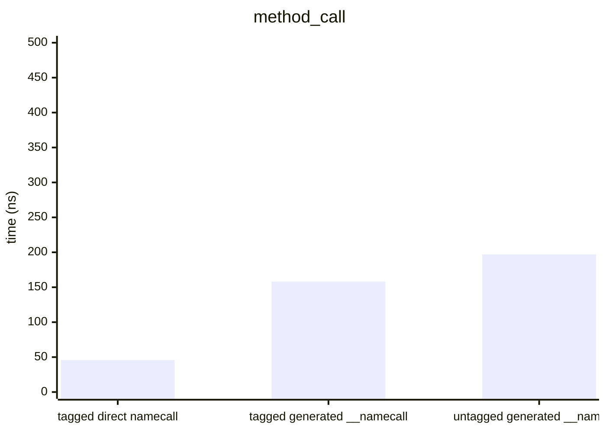
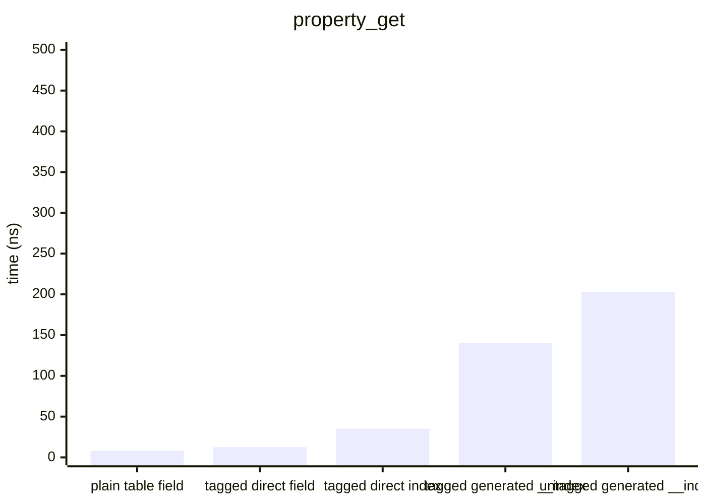
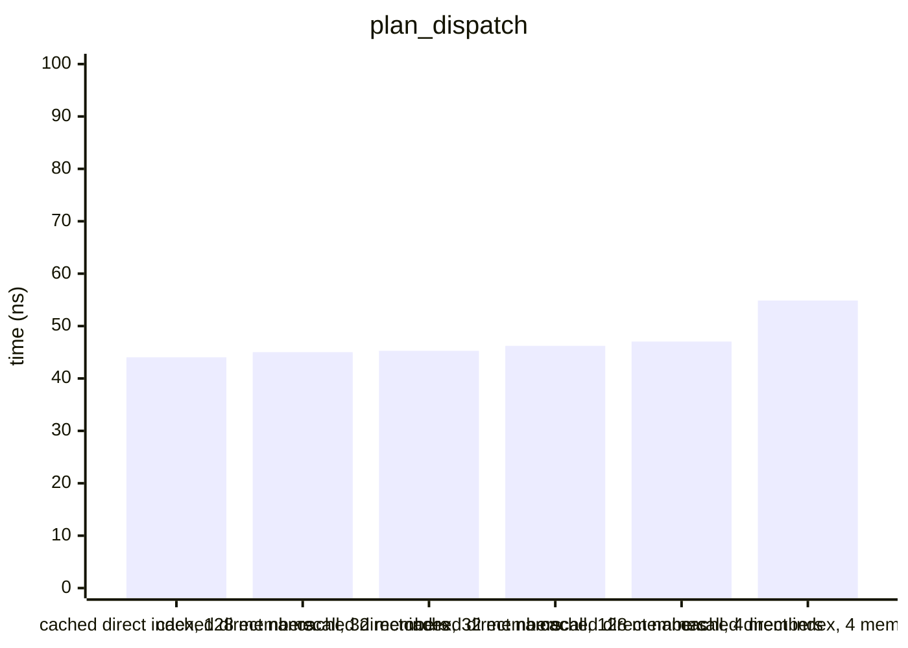
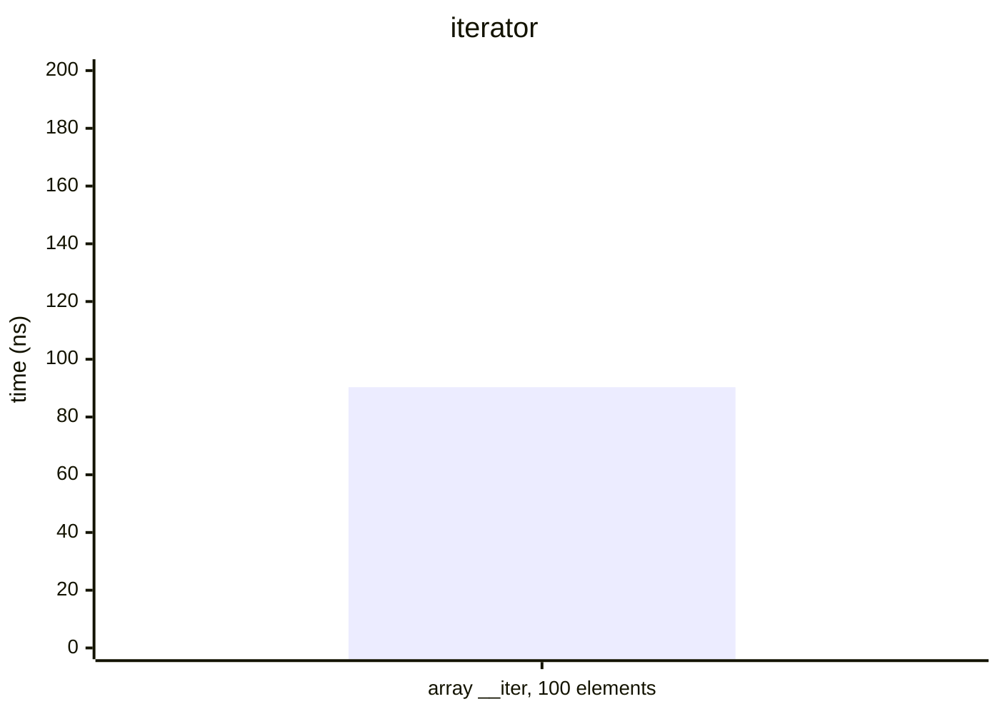
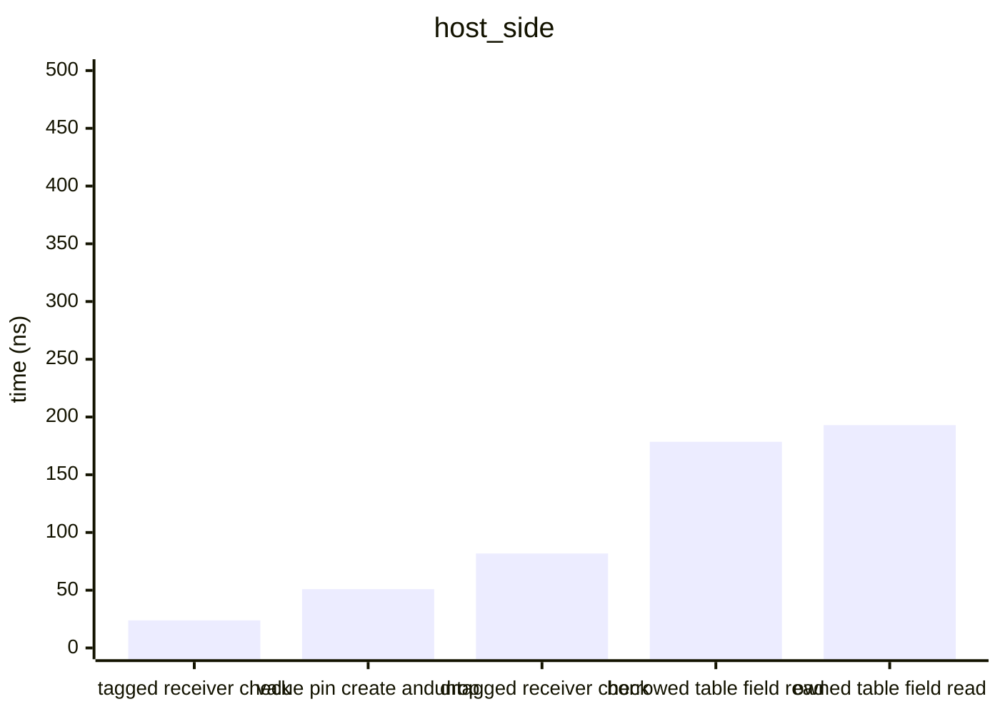

# Benchmarks

> Generated 2026-09-27 · `cargo bench --bench hot_paths` → Criterion → [scripts/gen_benchmarks.py](scripts/gen_benchmarks.py) · Intel(R) Core(TM) i7-10870H CPU @ 2.20GHz

All times are wall-clock means measured by [Criterion.rs](https://github.com/bheisler/criterion.rs) (95 % confidence interval). Debug assertions off, default features (interpreter only).

## rust_to_luau_call

`Function::invoke` from the host, per call.

| Variant | Mean | ± Std Dev |
|---|---:|---:|
| scalar (f64, f64) -> f64 | 85.34 ns | 2.77 ns |
| table argument, view result | 91.48 ns | 5.74 ns |
| table argument, pinned result | 135.5 ns | 2.74 ns |

## luau_to_rust_call

A Lua loop calling the bound function 1000 times; per call = loop / 1000.

| Variant | Mean | ± Std Dev | Per item |
|---|---:|---:|---:|
| hand-written lua_CFunction | 42.14 µs | 533.7 ns | 42.14 ns |
| captured Rust context | 67.08 µs | 8.64 µs | 67.08 ns |
| typed binder (f64, f64) -> f64 | 93.68 µs | 1.74 µs | 93.68 ns |
| Vector3 ingress | 162.6 µs | 3.64 µs | 162.6 ns |

## method_call

`obj:get()` 1000 times; per call = loop / 1000.

| Variant | Mean | ± Std Dev | Per item |
|---|---:|---:|---:|
| tagged direct namecall | 45.76 µs | 2.82 µs | 45.76 ns |
| tagged generated __namecall | 158.1 µs | 31.49 µs | 158.1 ns |
| untagged generated __namecall | 197.0 µs | 5.00 µs | 197.0 ns |

## property_get

`obj.value` 1000 times; per access = loop / 1000.

| Variant | Mean | ± Std Dev | Per item |
|---|---:|---:|---:|
| plain table field | 8.35 µs | 193.9 ns | 8.35 ns |
| tagged direct field | 12.50 µs | 461.3 ns | 12.50 ns |
| tagged direct index | 35.14 µs | 683.0 ns | 35.14 ns |
| tagged generated __index | 140.1 µs | 1.98 µs | 140.1 ns |
| untagged generated __index | 203.2 µs | 1.63 µs | 203.2 ns |

## plan_dispatch

Runtime-resolved `DirectPlan` dispatch with the cache hit path, 1000 accesses of the last member; per access = loop / 1000.

| Variant | Mean | ± Std Dev | Per item |
|---|---:|---:|---:|
| cached direct index, 128 members | 44.03 µs | 1.04 µs | 44.03 ns |
| cached direct namecall, 32 members | 45.02 µs | 1.91 µs | 45.02 ns |
| cached direct index, 32 members | 45.28 µs | 411.3 ns | 45.28 ns |
| cached direct namecall, 128 members | 46.22 µs | 1.47 µs | 46.22 ns |
| cached direct namecall, 4 members | 47.04 µs | 1.75 µs | 47.04 ns |
| cached direct index, 4 members | 54.87 µs | 5.30 µs | 54.87 ns |

## iterator

A generic `for` over a 100-element array iterator, 1000 loops; per element = loop / 100000.

| Variant | Mean | ± Std Dev | Per item |
|---|---:|---:|---:|
| array __iter, 100 elements | 9.03 ms | 55.78 µs | 90.33 ns |

## host_side

Host-side operations, per call.

| Variant | Mean | ± Std Dev |
|---|---:|---:|
| tagged receiver check | 23.90 ns | 0.70 ns |
| value pin create and drop | 50.89 ns | 17.18 ns |
| untagged receiver check | 81.78 ns | 0.97 ns |
| borrowed table field read | 178.6 ns | 2.28 ns |
| owned table field read | 193.0 ns | 2.65 ns |

