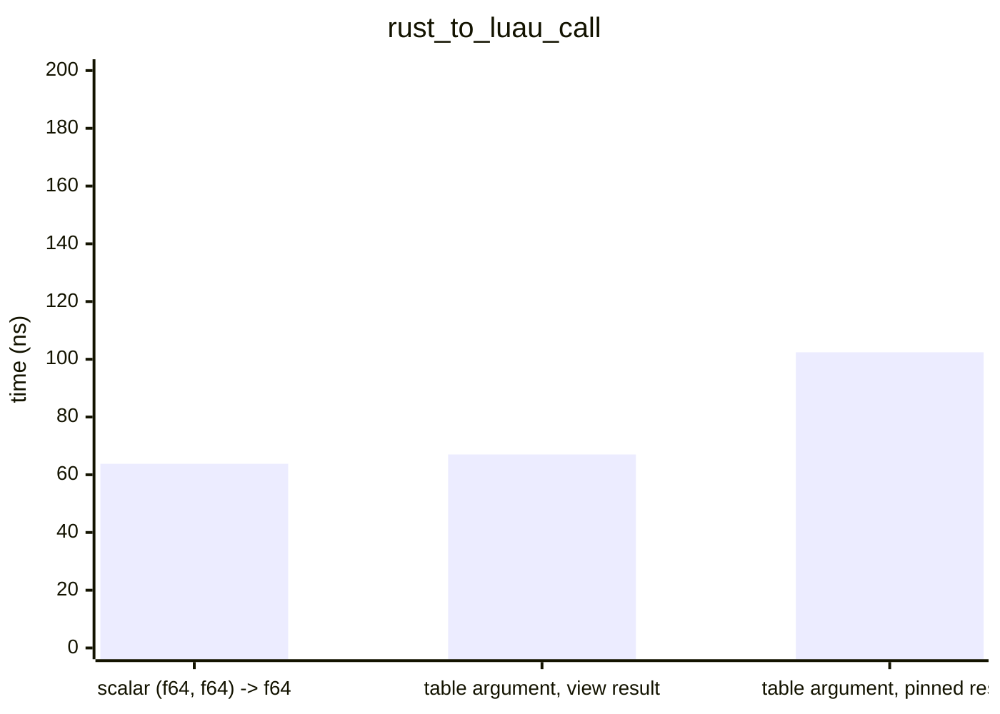
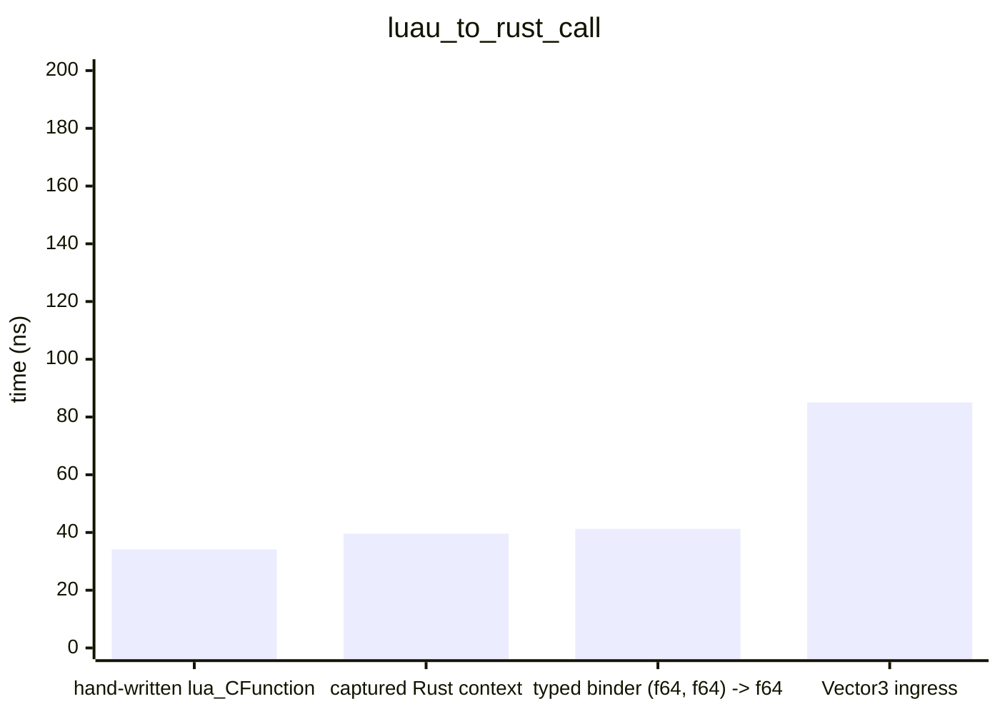
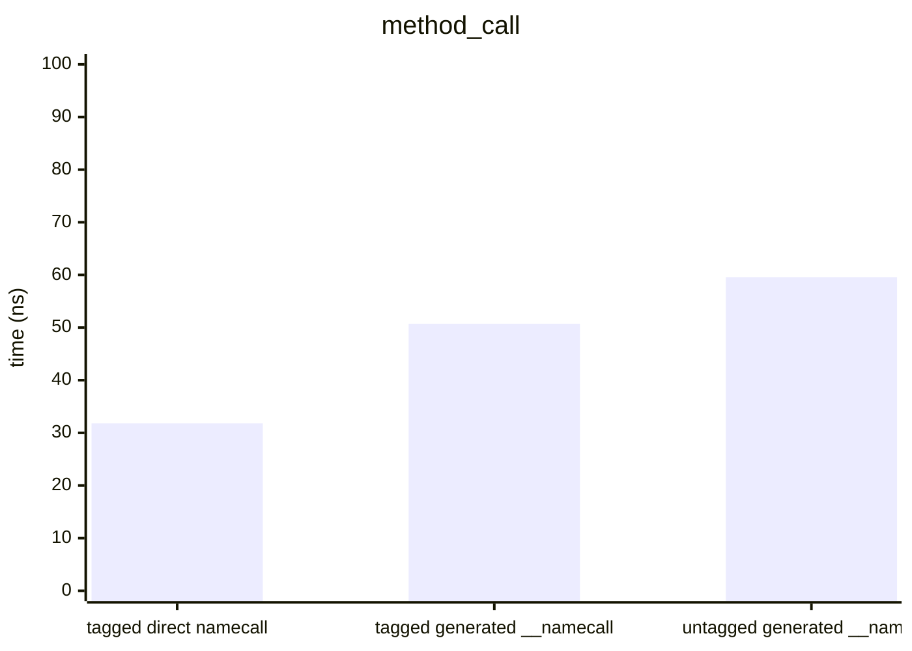
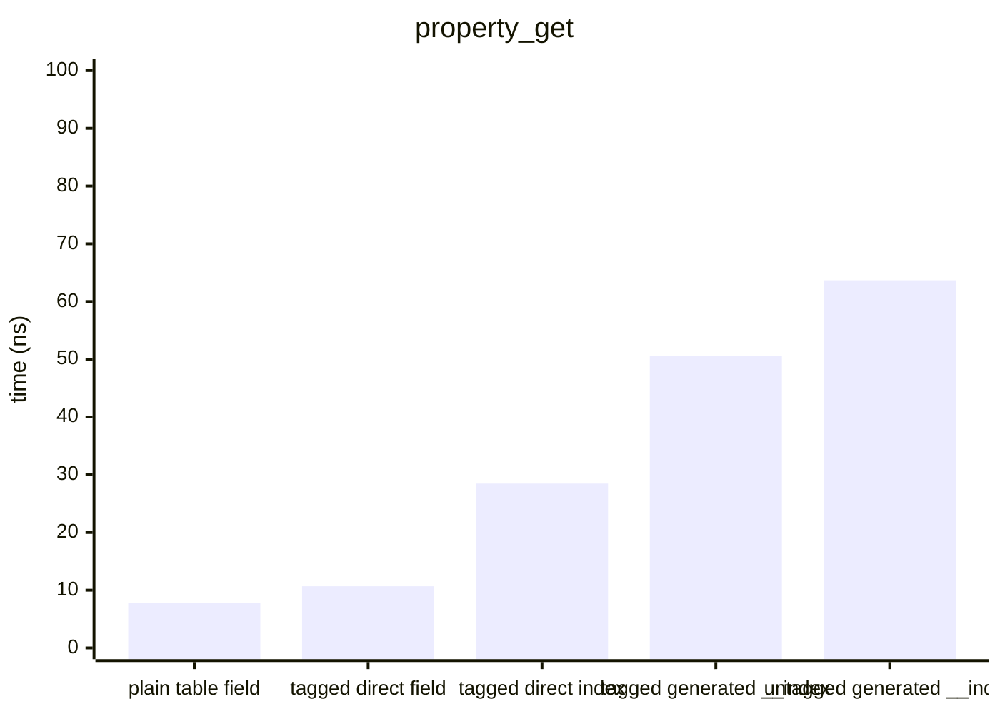
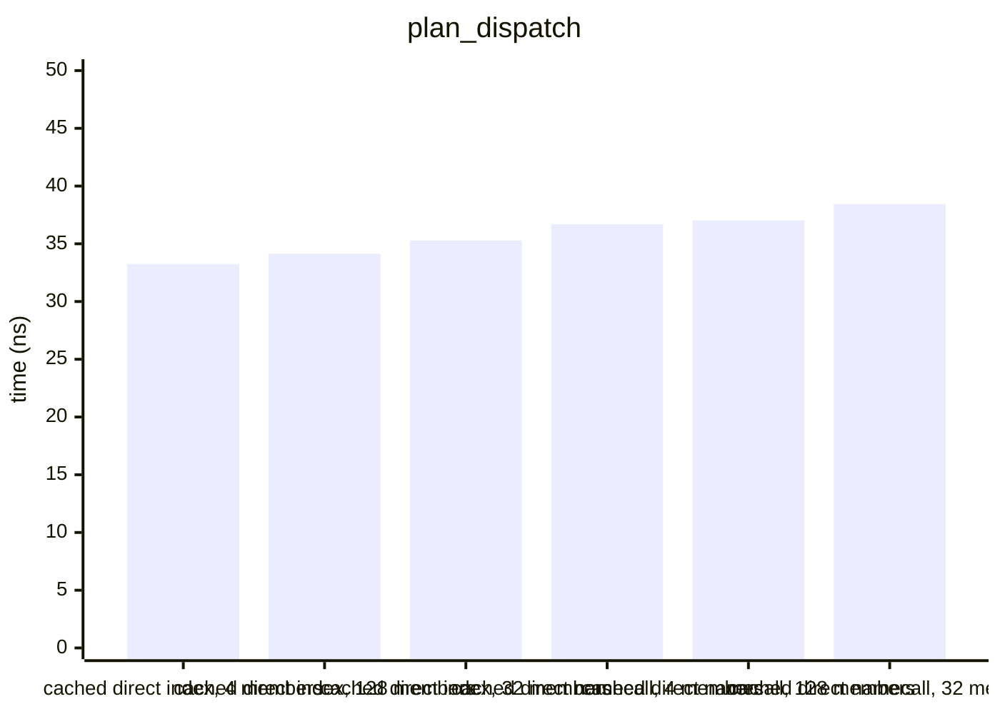
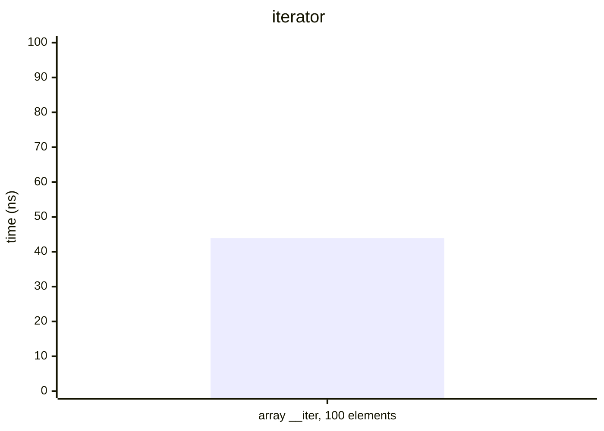
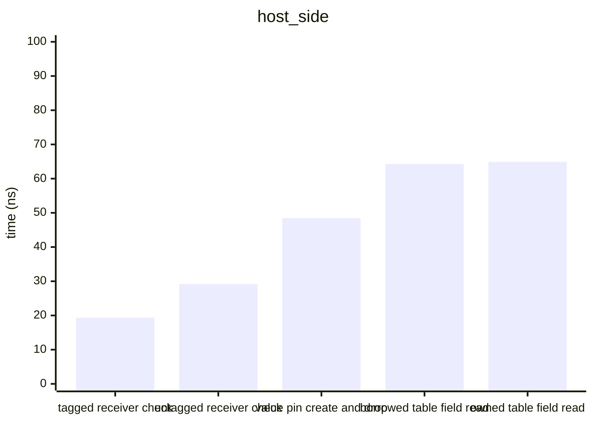
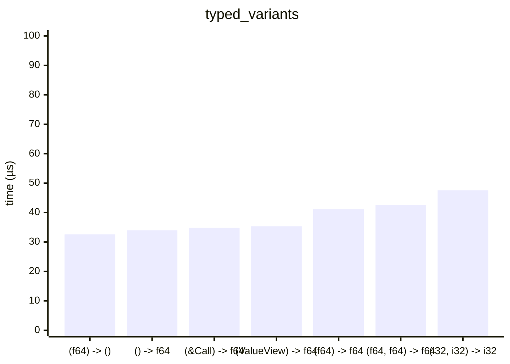

# Benchmarks

> Generated 2026-09-27 · `cargo bench --bench hot_paths` → Criterion → [scripts/gen_benchmarks.py](scripts/gen_benchmarks.py) · Intel(R) Core(TM) i7-10870H CPU @ 2.20GHz

All times are wall-clock means measured by [Criterion.rs](https://github.com/bheisler/criterion.rs) (95 % confidence interval). Debug assertions off, default features (interpreter only).

## rust_to_luau_call

`Function::invoke` from the host, per call.

| Variant | Mean | ± Std Dev |
|---|---:|---:|
| scalar (f64, f64) -> f64 | 63.79 ns | 3.36 ns |
| table argument, view result | 67.03 ns | 1.72 ns |
| table argument, pinned result | 102.4 ns | 5.06 ns |

## luau_to_rust_call

A Lua loop calling the bound function 1000 times; per call = loop / 1000.

| Variant | Mean | ± Std Dev | Per item |
|---|---:|---:|---:|
| hand-written lua_CFunction | 34.14 µs | 1.32 µs | 34.14 ns |
| captured Rust context | 39.61 µs | 575.2 ns | 39.61 ns |
| typed binder (f64, f64) -> f64 | 41.23 µs | 1.48 µs | 41.23 ns |
| Vector3 ingress | 85.05 µs | 1.70 µs | 85.05 ns |

## method_call

`obj:get()` 1000 times; per call = loop / 1000.

| Variant | Mean | ± Std Dev | Per item |
|---|---:|---:|---:|
| tagged direct namecall | 31.80 µs | 1.25 µs | 31.80 ns |
| tagged generated __namecall | 50.69 µs | 1.41 µs | 50.69 ns |
| untagged generated __namecall | 59.55 µs | 1.47 µs | 59.55 ns |

## property_get

`obj.value` 1000 times; per access = loop / 1000.

| Variant | Mean | ± Std Dev | Per item |
|---|---:|---:|---:|
| plain table field | 7.80 µs | 432.2 ns | 7.80 ns |
| tagged direct field | 10.68 µs | 334.6 ns | 10.68 ns |
| tagged direct index | 28.47 µs | 1.43 µs | 28.47 ns |
| tagged generated __index | 50.57 µs | 1.87 µs | 50.57 ns |
| untagged generated __index | 63.68 µs | 3.53 µs | 63.68 ns |

## plan_dispatch

Runtime-resolved `DirectPlan` dispatch with the cache hit path, 1000 accesses of the last member; per access = loop / 1000.

| Variant | Mean | ± Std Dev | Per item |
|---|---:|---:|---:|
| cached direct index, 4 members | 33.25 µs | 721.0 ns | 33.25 ns |
| cached direct index, 128 members | 34.14 µs | 696.0 ns | 34.14 ns |
| cached direct index, 32 members | 35.29 µs | 1.45 µs | 35.29 ns |
| cached direct namecall, 4 members | 36.69 µs | 1.20 µs | 36.69 ns |
| cached direct namecall, 128 members | 37.03 µs | 816.0 ns | 37.03 ns |
| cached direct namecall, 32 members | 38.45 µs | 340.5 ns | 38.45 ns |

## iterator

A generic `for` over a 100-element array iterator, 1000 loops; per element = loop / 100000.

| Variant | Mean | ± Std Dev | Per item |
|---|---:|---:|---:|
| array __iter, 100 elements | 4.39 ms | 437.0 µs | 43.92 ns |

## host_side

Host-side operations, per call.

| Variant | Mean | ± Std Dev |
|---|---:|---:|
| tagged receiver check | 19.34 ns | 0.64 ns |
| untagged receiver check | 29.18 ns | 0.72 ns |
| value pin create and drop | 48.47 ns | 17.13 ns |
| borrowed table field read | 64.28 ns | 2.80 ns |
| owned table field read | 64.91 ns | 2.55 ns |

## typed_variants

| Variant | Mean | ± Std Dev |
|---|---:|---:|
| (f64) -> () | 32.58 µs | 515.8 ns |
| () -> f64 | 33.97 µs | 309.6 ns |
| (&Call) -> f64 | 34.84 µs | 887.0 ns |
| (ValueView) -> f64 | 35.32 µs | 1.15 µs |
| (f64) -> f64 | 41.11 µs | 326.0 ns |
| (f64, f64) -> f64 | 42.58 µs | 1.23 µs |
| (i32, i32) -> i32 | 47.54 µs | 703.5 ns |

