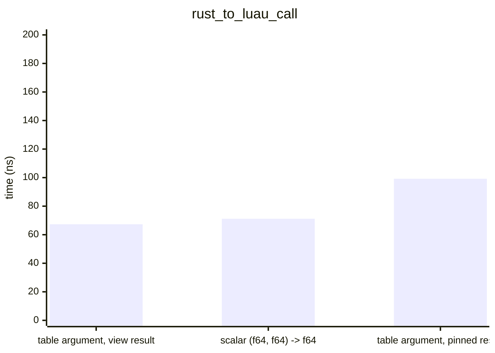
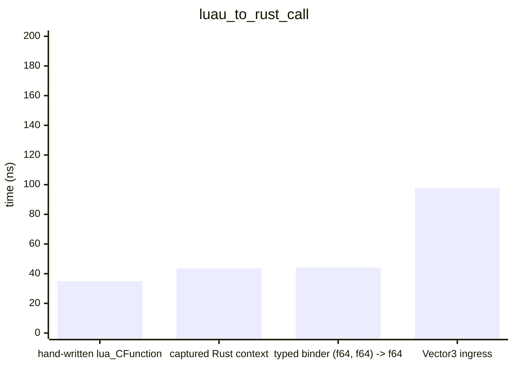
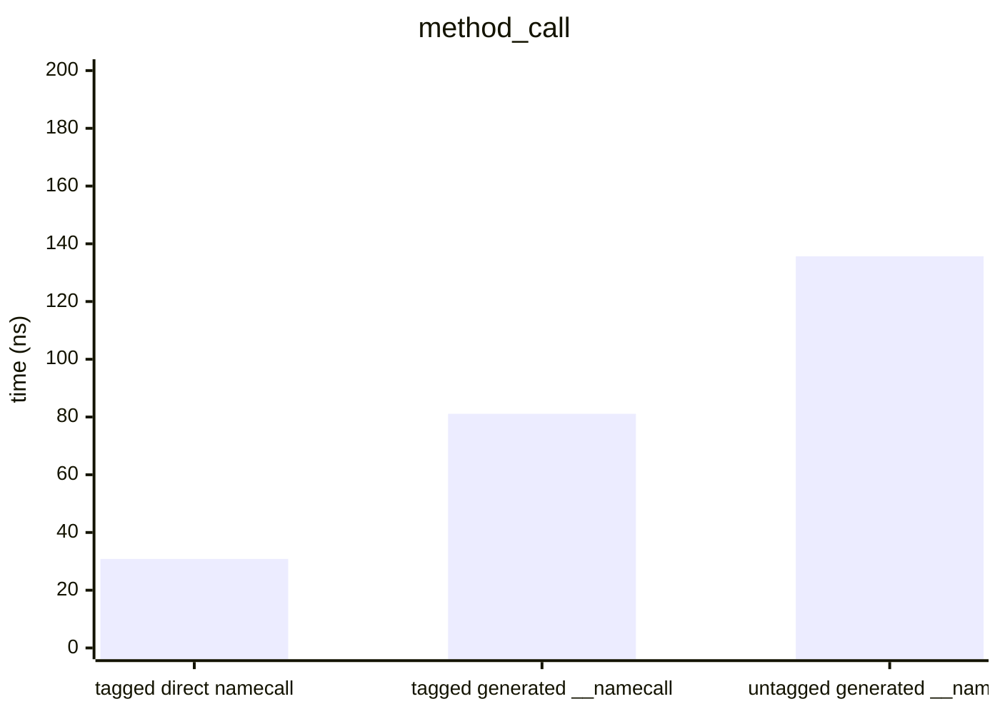
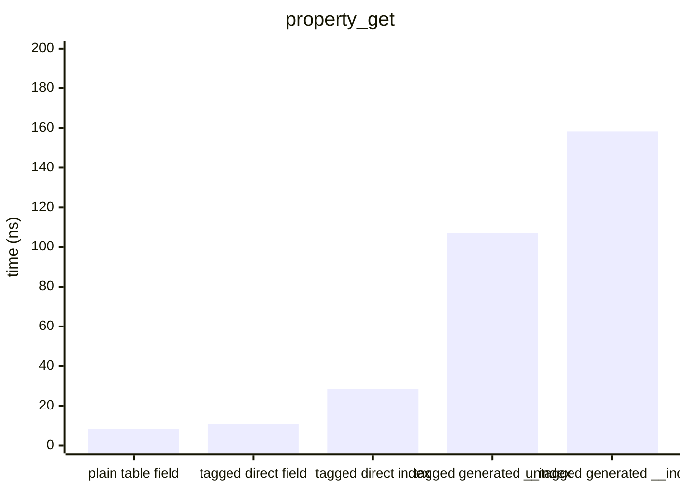
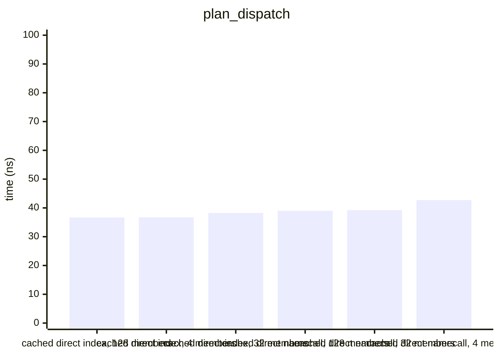
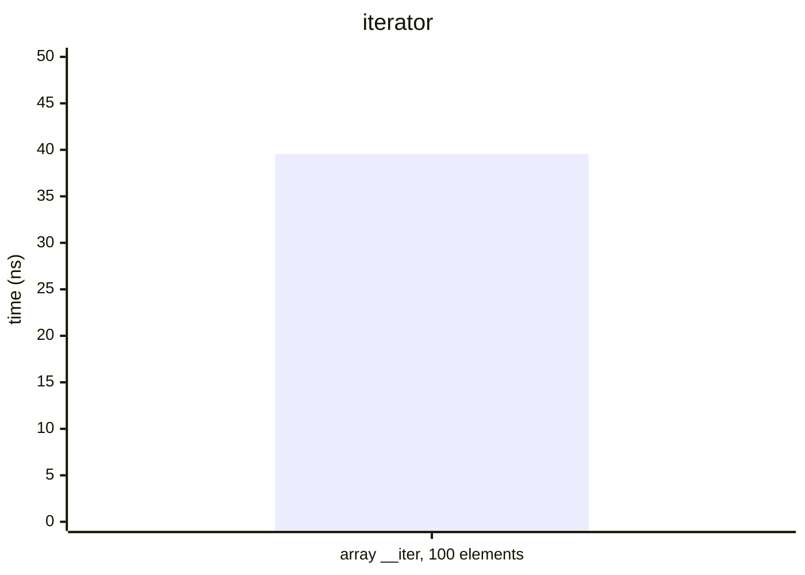
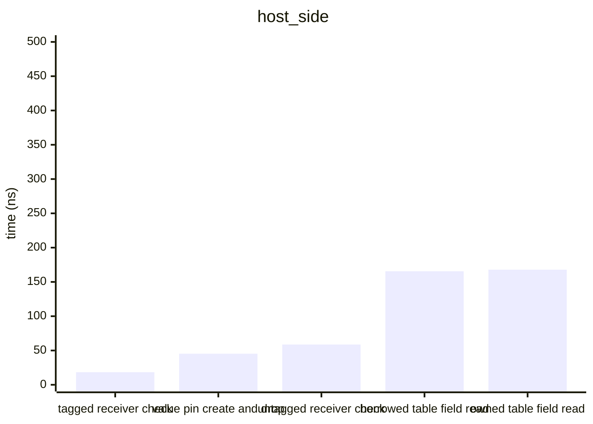
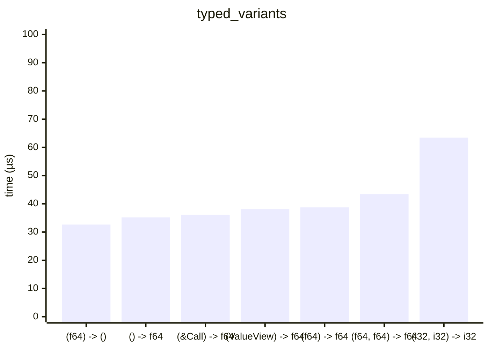

# Benchmarks

> Generated 2026-09-27 · `cargo bench --bench hot_paths` → Criterion → [scripts/gen_benchmarks.py](scripts/gen_benchmarks.py) · Intel(R) Core(TM) i7-10870H CPU @ 2.20GHz

All times are wall-clock means measured by [Criterion.rs](https://github.com/bheisler/criterion.rs) (95 % confidence interval). Debug assertions off, default features (interpreter only).

## rust_to_luau_call

`Function::invoke` from the host, per call.

| Variant | Mean | ± Std Dev |
|---|---:|---:|
| table argument, view result | 67.31 ns | 1.10 ns |
| scalar (f64, f64) -> f64 | 71.18 ns | 1.44 ns |
| table argument, pinned result | 99.19 ns | 3.21 ns |

## luau_to_rust_call

A Lua loop calling the bound function 1000 times; per call = loop / 1000.

| Variant | Mean | ± Std Dev | Per item |
|---|---:|---:|---:|
| hand-written lua_CFunction | 34.84 µs | 2.13 µs | 34.84 ns |
| captured Rust context | 43.57 µs | 620.4 ns | 43.57 ns |
| typed binder (f64, f64) -> f64 | 44.17 µs | 1.37 µs | 44.17 ns |
| Vector3 ingress | 97.51 µs | 1.63 µs | 97.51 ns |

## method_call

`obj:get()` 1000 times; per call = loop / 1000.

| Variant | Mean | ± Std Dev | Per item |
|---|---:|---:|---:|
| tagged direct namecall | 30.84 µs | 519.2 ns | 30.84 ns |
| tagged generated __namecall | 81.12 µs | 4.72 µs | 81.12 ns |
| untagged generated __namecall | 135.7 µs | 1.08 µs | 135.7 ns |

## property_get

`obj.value` 1000 times; per access = loop / 1000.

| Variant | Mean | ± Std Dev | Per item |
|---|---:|---:|---:|
| plain table field | 8.42 µs | 93.01 ns | 8.42 ns |
| tagged direct field | 10.89 µs | 260.8 ns | 10.89 ns |
| tagged direct index | 28.36 µs | 758.0 ns | 28.36 ns |
| tagged generated __index | 107.1 µs | 804.9 ns | 107.1 ns |
| untagged generated __index | 158.3 µs | 2.66 µs | 158.3 ns |

## plan_dispatch

Runtime-resolved `DirectPlan` dispatch with the cache hit path, 1000 accesses of the last member; per access = loop / 1000.

| Variant | Mean | ± Std Dev | Per item |
|---|---:|---:|---:|
| cached direct index, 128 members | 36.69 µs | 951.7 ns | 36.69 ns |
| cached direct index, 4 members | 36.72 µs | 2.18 µs | 36.72 ns |
| cached direct index, 32 members | 38.25 µs | 3.94 µs | 38.25 ns |
| cached direct namecall, 128 members | 39.00 µs | 1.07 µs | 39.00 ns |
| cached direct namecall, 32 members | 39.23 µs | 1.19 µs | 39.23 ns |
| cached direct namecall, 4 members | 42.75 µs | 2.70 µs | 42.75 ns |

## iterator

A generic `for` over a 100-element array iterator, 1000 loops; per element = loop / 100000.

| Variant | Mean | ± Std Dev | Per item |
|---|---:|---:|---:|
| array __iter, 100 elements | 3.95 ms | 138.4 µs | 39.55 ns |

## host_side

Host-side operations, per call.

| Variant | Mean | ± Std Dev |
|---|---:|---:|
| tagged receiver check | 18.36 ns | 0.33 ns |
| value pin create and drop | 45.26 ns | 16.23 ns |
| untagged receiver check | 58.73 ns | 4.02 ns |
| borrowed table field read | 165.6 ns | 1.55 ns |
| owned table field read | 167.9 ns | 2.83 ns |

## typed_variants

| Variant | Mean | ± Std Dev |
|---|---:|---:|
| (f64) -> () | 32.65 µs | 2.28 µs |
| () -> f64 | 35.18 µs | 647.6 ns |
| (&Call) -> f64 | 36.09 µs | 598.3 ns |
| (ValueView) -> f64 | 38.13 µs | 624.4 ns |
| (f64) -> f64 | 38.74 µs | 2.42 µs |
| (f64, f64) -> f64 | 43.44 µs | 808.6 ns |
| (i32, i32) -> i32 | 63.44 µs | 10.18 µs |

