# Benchmarks

> Generated 2026-09-28 · `cargo bench --bench hot_paths` → Criterion → [scripts/gen_benchmarks.py](scripts/gen_benchmarks.py) · Intel(R) Core(TM) i7-10870H CPU @ 2.20GHz

All times are wall-clock means measured by [Criterion.rs](https://github.com/bheisler/criterion.rs) (95 % confidence interval). Debug assertions off, default features (interpreter only).

> `cargo bench --bench patterns` compares JSL record binding patterns with same-contract handwritten extraction, interpreted and native; see [PATTERNS.md](PATTERNS.md).
>
> `cargo bench --features tcp --bench tcp` measures `@dream/tcp` over loopback: throughput by transfer size against `std::net`, one bound call, connection setup, poller dispatch at 1, 32 and 256 connections, CPU while waiting, and memory per handle and watch; see [Built-in extensions](https://DreamWeave-MP.github.io/l3i/docs/builtin-extensions/#dream-tcp).
>
> `cargo bench --features intl --bench intl` counts `@dream/intl`'s construction, warm calls, the binding boundary and handle retention; see [Built-in extensions](https://DreamWeave-MP.github.io/l3i/docs/builtin-extensions/#dream-intl).
>
> `cargo bench --bench comprehension` now measures dense/filtered projections, allocation-free count fusion, and callback comparisons on the real checkout. See [comprehension integration evidence](COMPREHENSIONS.md) for retired CPU instructions, deterministic executed VM counts, secondary timings, inference, and diagnostic limitations. Those results are separate from the generated 2026-09-28 tables below.

## rust_to_luau_call

`Function::invoke` from the host, per call.

| Variant | Mean | ± Std Dev |
|---|---:|---:|
| scalar (f64, f64) -> f64 | 63.29 ns | 1.95 ns |
| table argument, view result | 69.95 ns | 1.31 ns |
| table argument, pinned result | 107.3 ns | 4.54 ns |

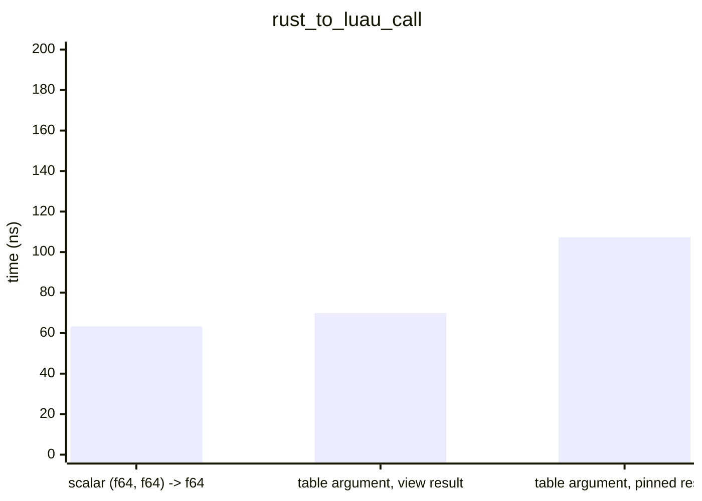

## luau_to_rust_call

A Lua loop calling the bound function 1000 times; per call = loop / 1000.

| Variant | Mean | ± Std Dev | Per item |
|---|---:|---:|---:|
| hand-written lua_CFunction | 35.73 µs | 1.04 µs | 35.73 ns |
| captured Rust context | 39.97 µs | 1.57 µs | 39.97 ns |
| typed binder (f64, f64) -> f64 | 44.86 µs | 1.94 µs | 44.86 ns |
| Vector3 ingress | 90.73 µs | 1.36 µs | 90.73 ns |

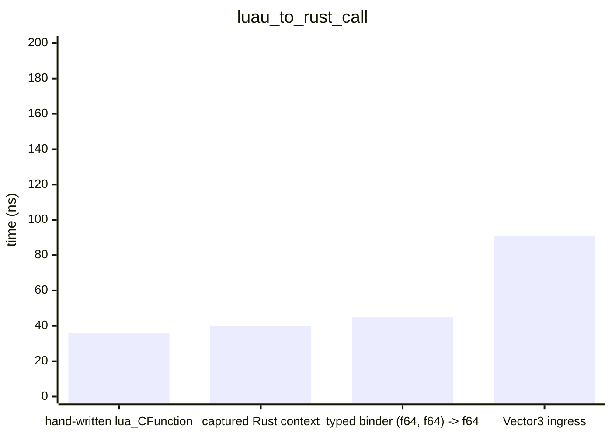

## method_call

`obj:get()` 1000 times; per call = loop / 1000.

| Variant | Mean | ± Std Dev | Per item |
|---|---:|---:|---:|
| tagged direct namecall | 32.25 µs | 461.6 ns | 32.25 ns |
| tagged generated __namecall | 52.36 µs | 707.5 ns | 52.36 ns |
| untagged generated __namecall | 72.15 µs | 4.37 µs | 72.15 ns |

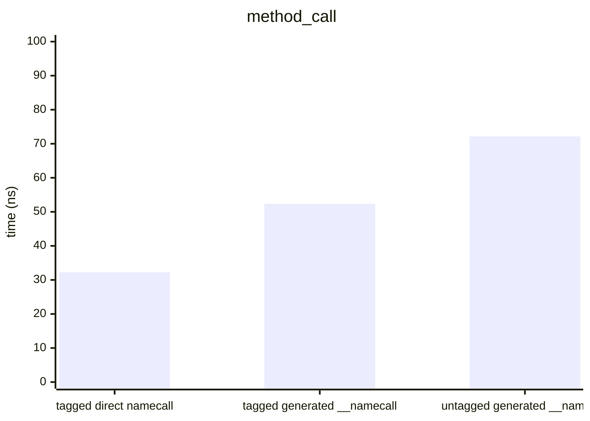

## property_get

`obj.value` 1000 times; per access = loop / 1000.

| Variant | Mean | ± Std Dev | Per item |
|---|---:|---:|---:|
| plain table field | 8.58 µs | 419.6 ns | 8.58 ns |
| tagged direct field | 12.48 µs | 170.1 ns | 12.48 ns |
| tagged direct index | 32.56 µs | 418.2 ns | 32.56 ns |
| tagged generated __index | 58.89 µs | 1.96 µs | 58.89 ns |
| untagged generated __index | 73.52 µs | 1.56 µs | 73.52 ns |

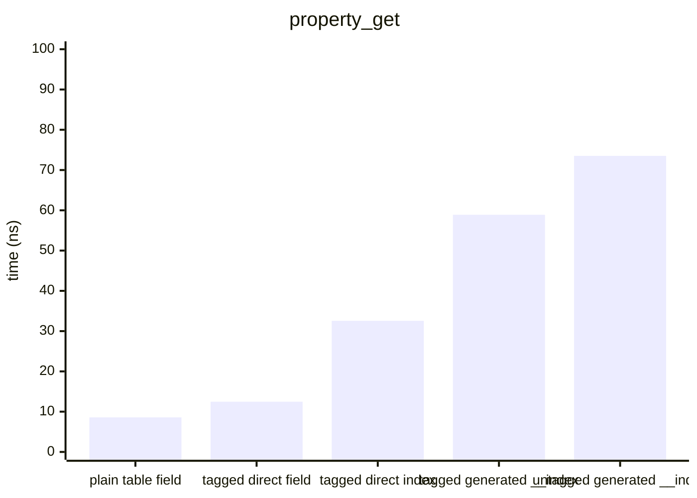

## plan_dispatch

Runtime-resolved `DirectPlan` dispatch with the cache hit path, 1000 accesses of the last member; per access = loop / 1000.

| Variant | Mean | ± Std Dev | Per item |
|---|---:|---:|---:|
| cached direct index, 4 members | 40.83 µs | 909.1 ns | 40.83 ns |
| cached direct index, 32 members | 42.48 µs | 2.71 µs | 42.48 ns |
| cached direct namecall, 4 members | 43.35 µs | 1.32 µs | 43.35 ns |
| cached direct namecall, 32 members | 43.42 µs | 431.1 ns | 43.42 ns |
| cached direct index, 128 members | 45.45 µs | 3.59 µs | 45.45 ns |
| cached direct namecall, 128 members | 48.56 µs | 487.3 ns | 48.56 ns |

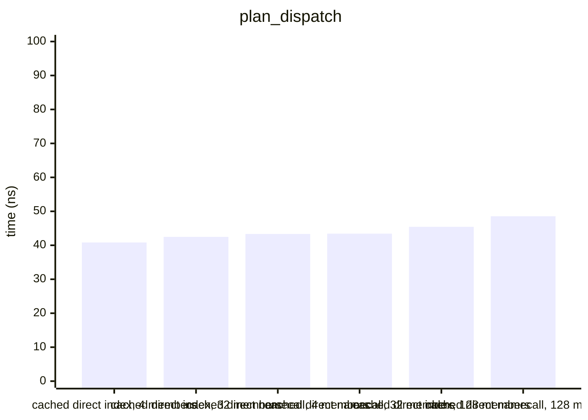

## iterator

A generic `for` over a 100-element array iterator, 1000 loops; per element = loop / 100000.

| Variant | Mean | ± Std Dev | Per item |
|---|---:|---:|---:|
| array __iter, 100 elements | 4.44 ms | 43.40 µs | 44.38 ns |

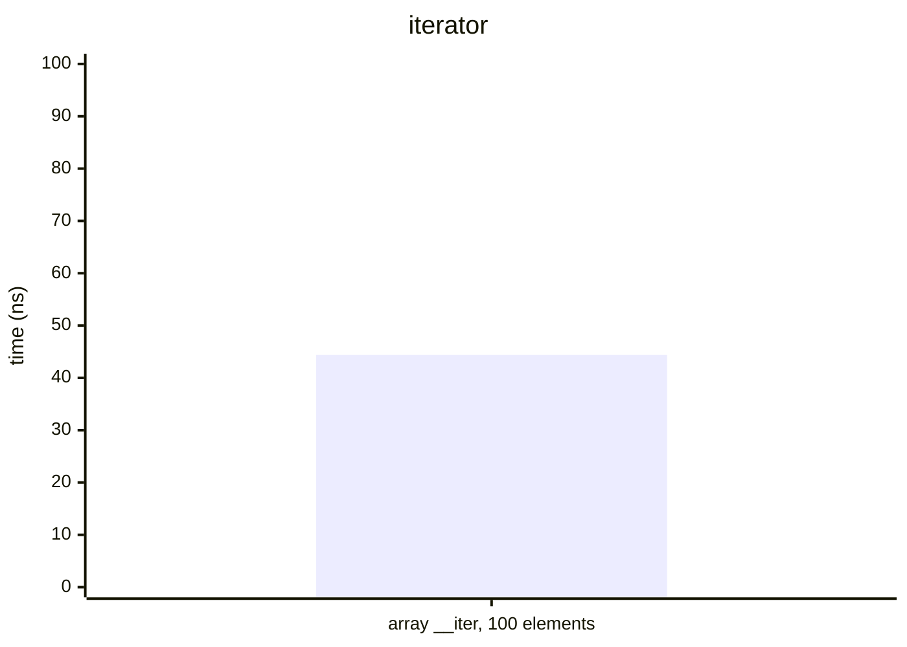

## host_side

Host-side operations, per call.

| Variant | Mean | ± Std Dev |
|---|---:|---:|
| tagged receiver check | 19.63 ns | 1.97 ns |
| untagged receiver check | 36.58 ns | 1.66 ns |
| value pin create and drop | 57.87 ns | 20.43 ns |
| owned table field read | 67.74 ns | 2.15 ns |
| borrowed table field read | 71.16 ns | 1.59 ns |

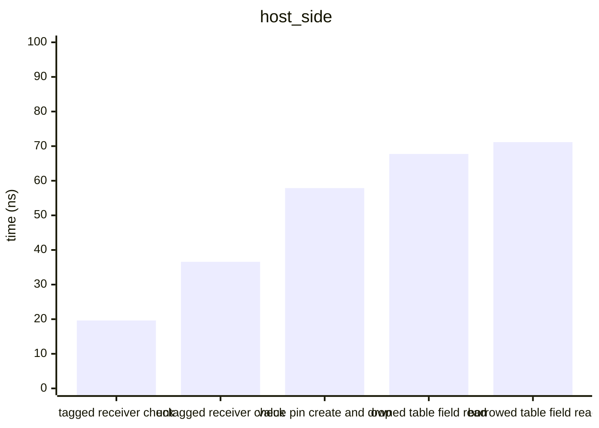

## extension_dispatch

| Variant | Mean | ± Std Dev |
|---|---:|---:|
| tagged planned direct field | 13.67 µs | 568.0 ns |
| tagged planned direct index | 50.09 µs | 709.2 ns |
| tagged planned cold namecall | 53.51 µs | 453.5 ns |
| tagged planned direct namecall | 54.52 µs | 671.5 ns |
| untagged planned namecall | 69.78 µs | 425.4 ns |
| untagged planned index | 73.23 µs | 1.54 µs |

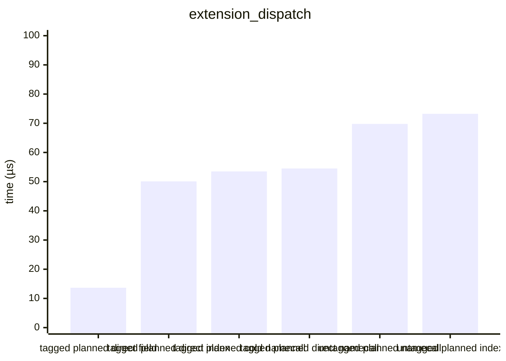

## udp_bridge

| Variant | Mean | ± Std Dev |
|---|---:|---:|
| idle update + empty pollInto, both ends | 5.13 µs | 96.54 ns |
| client sendEvent + flush | 58.72 µs | 800.1 ns |
| client send, server update + pollInto | 220.0 µs | 3.26 µs |

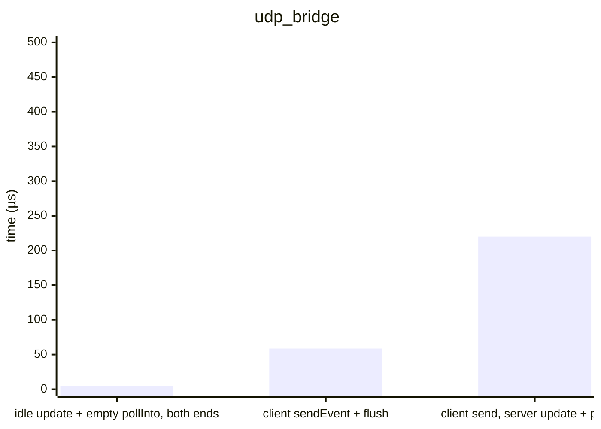

## packed_quat_luau

| Variant | Mean | ± Std Dev |
|---|---:|---:|
| userdata rotate vector | 56.72 µs | 2.33 µs |
| packed rotate vector | 76.70 µs | 1.74 µs |
| userdata mul (allocates) | 129.9 µs | 2.21 µs |
| packed mul | 137.9 µs | 10.68 µs |
| userdata slerp (allocates) | 180.3 µs | 1.75 µs |
| packed slerp | 194.0 µs | 7.69 µs |

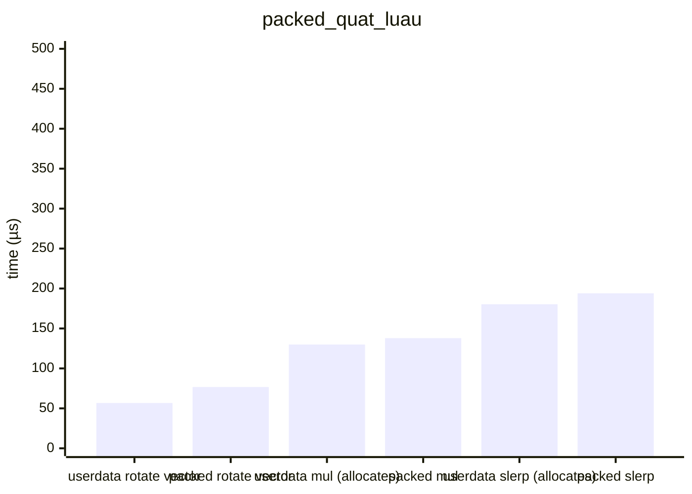

## packed_quat_raw

| Variant | Mean | ± Std Dev |
|---|---:|---:|
| f64 mul (reference) | 4.19 µs | 368.3 ns |
| decode smallest-three | 8.99 µs | 503.4 ns |
| encode smallest-three | 23.18 µs | 783.3 ns |
| decode, mul, encode | 70.08 µs | 3.12 µs |

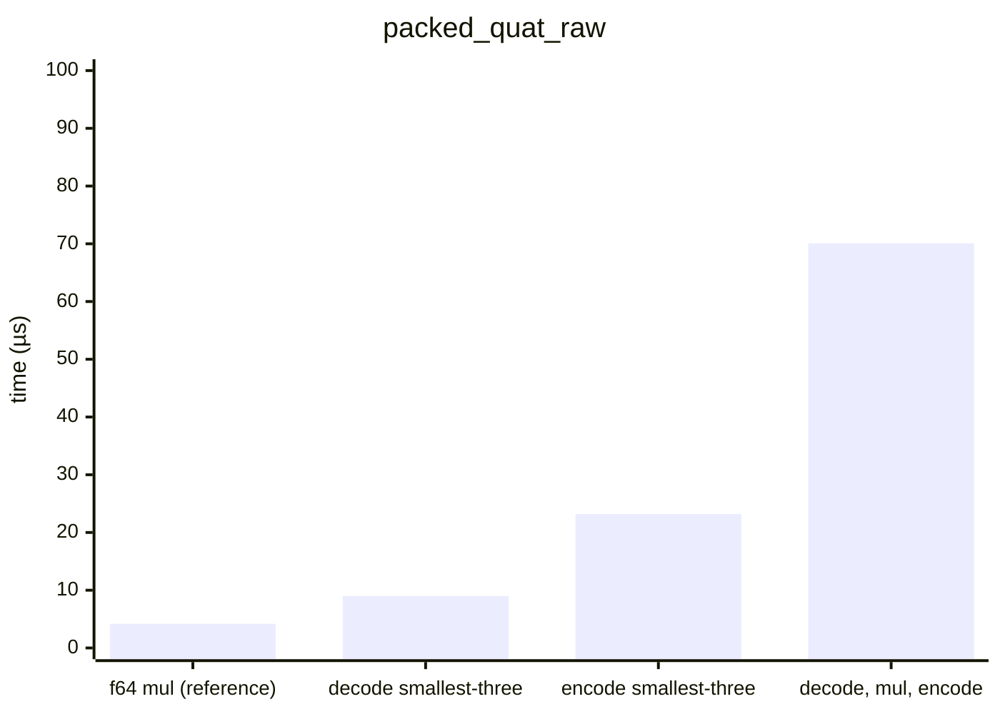

## typed_variants

| Variant | Mean | ± Std Dev |
|---|---:|---:|
| (f64) -> () | 37.11 µs | 247.7 ns |
| (ValueView) -> f64 | 41.26 µs | 429.0 ns |
| () -> f64 | 43.59 µs | 6.45 µs |
| (f64) -> f64 | 46.18 µs | 2.39 µs |
| (&Call) -> f64 | 47.27 µs | 8.07 µs |
| (f64, f64) -> f64 | 49.92 µs | 1.54 µs |
| (i32, i32) -> i32 | 58.65 µs | 847.4 ns |

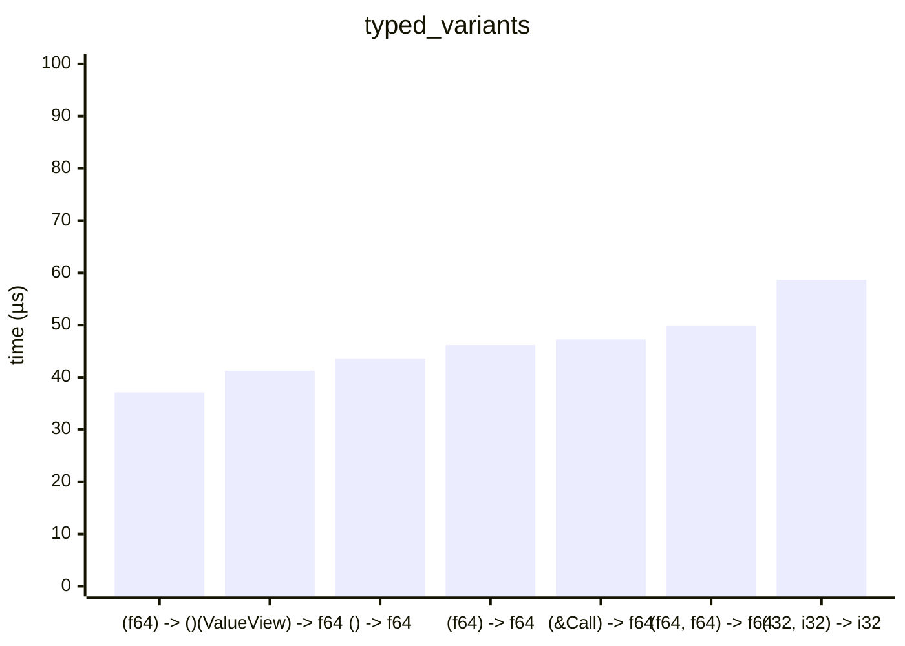
